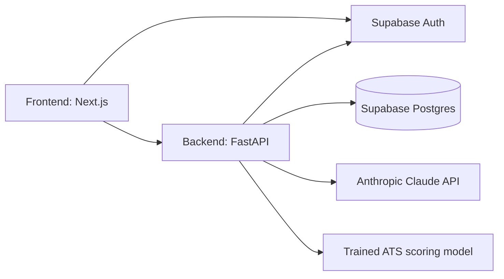

# Zenith (AI Career Coach)

AI-powered resume analysis and interview coaching: upload a resume + job description, get a real ATS match score with a skills gap breakdown, then practice interview questions with AI feedback.

## Problem Statement
Job seekers need an integrated tool to beat ATS systems and prepare for interviews. Combining resume analysis and interactive interview coaching provides a cohesive platform to secure their target roles.

## Architecture


- **Auth**: Supabase Auth (email/password + verification, password reset). The frontend talks to Supabase directly for sign-up/login (httpOnly session cookies via `@supabase/ssr`); the backend verifies the same Supabase-issued JWT on every API request (JWKS-based, no shared secret needed on modern Supabase projects).
- **Database**: Supabase Postgres. Schema is managed with Alembic migrations (`backend/alembic/`) — never edited by hand against the live DB.
- **LLM**: Anthropic Claude (Messages API, tool-use-forced JSON) for resume scoring, interview question generation, and answer evaluation. If `ANTHROPIC_API_KEY` is unset or a call fails, the resume analyzer falls back to a rule-based keyword scorer and the interview coach falls back to a seed question dataset, so the app still works without a key.
- **Trained ATS model** (`backend/app/ml/`): a small, fast regression model trained on LLM-labeled `(resume, job description, score)` pairs — see "ATS scoring model" below. Optional; the LLM/rule-based path above is what the live app uses today.

## Prerequisites
- **Python 3.12+**
- **Node.js 20+** (developed against 24) and npm
- **Git**
- A **Supabase** project (ask a teammate for shared dev credentials, or create your own at [supabase.com](https://supabase.com))
- An **Anthropic API key** (optional but recommended — [console.anthropic.com](https://console.anthropic.com)); the app works in a degraded mode without one

## Setup Instructions

1. **Clone the repo:**
   ```
   git clone https://github.com/dv-saiharsha/AI-Career-Coach.git
   cd AI-Career-Coach
   ```

2. **One-time: enable the team git hooks** (see "Working as a team" below for what this does):
   ```
   git config core.hooksPath .githooks
   ```

3. **Backend:**
   ```
   cd backend
   python -m venv .venv
   .venv\Scripts\activate
   pip install -r requirements.txt
   copy .env.example .env
   ```
   Fill in `backend/.env` — `DB_URL` (Supabase Postgres connection string), `SUPABASE_URL`, `ANTHROPIC_API_KEY`. See the comments in `.env.example` for exactly where to find each value in the Supabase/Anthropic dashboards.

   Apply the database schema:
   ```
   python -m alembic upgrade head
   ```

4. **Frontend:**
   ```
   cd frontend
   npm install
   copy .env.local.example .env.local
   ```
   Fill in `frontend/.env.local` — `NEXT_PUBLIC_SUPABASE_URL` and `NEXT_PUBLIC_SUPABASE_PUBLISHABLE_KEY` (same Supabase project as the backend).

5. **Run both servers with one command** from the repo root:
   ```
   start.bat
   ```
   This opens two windows (backend on :8000, frontend on :3000). Or run them individually:
   ```
   cd backend && .venv\Scripts\python.exe -m uvicorn app.main:app --reload --port 8000
   cd frontend && npm run dev
   ```

6. Open `http://localhost:3000`, register an account (check your email to verify), then use the Resume Analyzer and Interview Coach.

## Running tests
```
cd backend
.venv\Scripts\python.exe -m pytest
```

## ATS scoring model (optional, in progress)
`backend/app/ml/` holds a trained regression model that scores resumes numerically instead of via an LLM call — faster, free to run, and deterministic. It's trained on data produced by scripts in `backend/scripts/`:

- `generate_seed_resumes.py` / `generate_job_descriptions.py` — generate synthetic training resumes/JDs via Claude (each has a `--confirm` gate and prints a cost estimate first — never run `--confirm` without knowing the cost).
- `generate_training_data.py` — labels `(resume, JD)` pairs using the same LLM analyzer the live app uses, caching every label so reruns cost nothing.
- `train_ats_model.py` — trains the model with 5-fold cross-validation and reports honest MAE/R² (also free — no API calls, pure local scikit-learn).

The trained model file (`app/ml/models/*.joblib`) is gitignored — regenerate it locally by running `train_ats_model.py` against `backend/data/training_data.csv` (also gitignored/local; regenerate via the scripts above). `app/ml/models/ats_model_metadata.json` (accuracy, dataset size, training date) *is* tracked, so everyone can see what the last trained run achieved without retraining.

## Working as a team

**Dependencies auto-install after `git pull`.** After the one-time `git config core.hooksPath .githooks` step above, every `git pull` that brings in a changed `backend/requirements.txt` or `frontend/package.json`/`package-lock.json` automatically reinstalls the right dependencies — nobody has to remember to run `pip install` or `npm install` after pulling someone else's changes. This is a per-machine git setting (a git limitation, not a shortcut skipped here), which is why it's a one-time command rather than something that "just works" on clone.

**Database migrations are never auto-applied**, even by the hook above — the Supabase database is shared across the team, so a schema change from someone else's pull only prints a reminder to review and run `alembic upgrade head` yourself, rather than silently altering the shared database the moment you pull.

**Before pushing:** run the backend test suite (above) and make sure both `npm run build` (frontend) and a quick manual click-through still work. If you add a new environment variable, add it (with a placeholder, never a real value) to `backend/.env.example` or `frontend/.env.local.example` so teammates' setups keep working after they pull.
