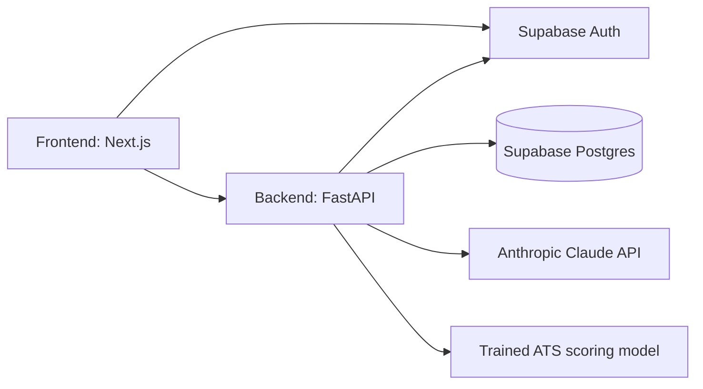

# ApplyCenter (AI Career Coach)

AI-powered resume analysis and interview coaching: upload a resume + job description, get a real ATS match score with a skills gap breakdown, then practice interview questions with AI feedback.

## Problem Statement
Job seekers need an integrated tool to beat ATS systems and prepare for interviews. Combining resume analysis and interactive interview coaching provides a cohesive platform to secure their target roles.

## Architecture


- **Auth**: Supabase Auth (email/password + verification, password reset). The frontend talks to Supabase directly for sign-up/login (httpOnly session cookies via `@supabase/ssr`); the backend verifies the same Supabase-issued JWT on every API request (JWKS-based, no shared secret needed on modern Supabase projects).
- **Database**: Supabase Postgres. Schema is managed with Alembic migrations (`backend/alembic/`) — never edited by hand against the live DB.
- **LLM**: Anthropic Claude (Messages API, tool-use-forced JSON) for resume scoring, interview question generation, and answer evaluation. If `ANTHROPIC_API_KEY` is unset or a call fails, the resume analyzer falls back to a rule-based keyword scorer and the interview coach falls back to a seed question dataset, so the app still works without a key.
- **Trained ATS model** (`backend/app/ml/`): a small, fast regression model trained on LLM-labeled `(resume, job description, score)` pairs — see "ATS scoring model" below. Optional; the LLM/rule-based path above is what the live app uses today.

## Prerequisites
- **Python 3.12+** — not 3.11. `numpy` 2.5.1 declares `requires_python >= 3.12`, so 3.11 fails at install with a misleading "no matching distribution" error.
- **Node.js 24** (ships npm 11) — 24 is what CI pins and what generated `package-lock.json`. Node 20 is too old for `@supabase/supabase-js` (needs >= 22), and Node 22 ships npm 10, which resolves optional wasm bindings into a different tree and makes `npm ci` fail. Use 24 and `npm ci` works everywhere.
- **Git**
- A **Supabase** project (ask a teammate for shared dev credentials, or create your own at [supabase.com](https://supabase.com))
- An **Anthropic API key** (optional but recommended — [console.anthropic.com](https://console.anthropic.com)); the app works in a degraded mode without one

## Setup Instructions

**Short version** — clone, then:

```
git config core.hooksPath .githooks
npm run setup
npm run dev
```

`npm run setup` creates env files from the templates, builds the Python
virtualenv, and installs both dependency sets. Fill in the two env files it
reports, run `npm run migrate`, then `npm run dev`. The long version below
explains each step.

---

1. **Clone the repo:**
   ```
   git clone https://github.com/dv-saiharsha/AI-Career-Coach.git
   cd AI-Career-Coach
   ```

2. **One-time: enable the team git hooks** (see "Working as a team" below for what this does):
   ```
   git config core.hooksPath .githooks
   ```

3. **Create your env files from the templates:**
   ```
   scripts\setup-env.bat          REM Windows
   bash scripts/setup-env.sh      # macOS / Linux / Git Bash
   ```
   This copies `frontend/.env.local.example` -> `frontend/.env.local` and
   `backend/.env.example` -> `backend/.env`. It never overwrites a file that
   already exists, so it is safe to re-run after a pull that adds a new
   variable. Then fill in the real values — ask a teammate for shared dev
   credentials rather than creating your own Supabase project, since the
   database is shared and a fresh project will not have the schema.

4. **Backend:**
   ```
   cd backend
   python -m venv .venv
   .venv\Scripts\activate
   pip install -r requirements.txt
   ```
   Fill in `backend/.env` (created in step 3) — `DB_URL` (Supabase Postgres connection string), `SUPABASE_URL`, `ANTHROPIC_API_KEY`. See the comments in `.env.example` for exactly where to find each value in the Supabase/Anthropic dashboards.

   Apply the database schema:
   ```
   python -m alembic upgrade head
   ```

5. **Frontend:**
   ```
   cd frontend
   npm ci
   ```
   `npm ci` rather than `npm install`: it installs exactly what `package-lock.json`
   pins, so everyone gets an identical tree. Use `npm install` only when you are
   deliberately adding or upgrading a dependency.

   Fill in `frontend/.env.local` (created in step 3) — `NEXT_PUBLIC_SUPABASE_URL` and `NEXT_PUBLIC_SUPABASE_PUBLISHABLE_KEY` (same Supabase project as the backend).

6. **Run both servers with one command** from the repo root:
   ```
   npm run dev
   ```
   Starts the backend (:8000) and frontend (:3000) together with prefixed
   output. Ctrl+C stops both, and if either crashes the other is stopped too,
   so you never end up with an orphaned server holding a port. Windows users
   can still double-click `start.bat`, which now just calls this.

   To run them separately instead:
   ```
   npm run backend -- -m uvicorn app.main:app --reload --port 8000
   npm --prefix frontend run dev
   ```

7. Open `http://localhost:3000`, register an account (check your email to verify), then use the Resume Analyzer and Interview Coach.

## Root commands

Run these from the repo root; they work the same on Windows, macOS and Linux.

| Command | What it does |
|---------|--------------|
| `npm run setup` | Env files, Python virtualenv, both dependency sets. Idempotent. |
| `npm run dev` | Backend + frontend together, prefixed output, Ctrl+C stops both |
| `npm start` | Same, production mode (`npm run build` first) |
| `npm run build` | Production build of the frontend |
| `npm test` | Backend test suite |
| `npm run check` | Everything CI runs — do this before pushing |
| `npm run migrate` | `alembic upgrade head` (review first — the database is shared) |
| `npm run backend -- <args>` | Any command against the venv Python |

### Serving the production build

`npm run dev` and `npm start` both just work. The one that does not is the
standalone server, and it is worth knowing why because `next start` prints a
warning steering you straight at it:

```
⚠ "next start" does not work with "output: standalone" configuration.
  Use "node .next/standalone/server.js" instead.
```

`next.config.ts` sets `output: "standalone"` so the Docker image ships a
traced, minimal `node_modules` instead of the whole tree. That output
deliberately excludes `.next/static` and `public/` — Next assumes a real
deployment serves them from a CDN. The Dockerfile copies both in as separate
layers, so the image is fine; running the same server locally was not, and
every CSS and JS chunk 404'd.

`npm run build` now runs `postbuild`, which copies both into
`.next/standalone/` exactly as the Dockerfile does. After a build:

```bash
cd frontend && npm run start:standalone
```

### Reaching either app from a phone

Next prints a `Network:` URL, and on a machine with WSL or Docker installed
that URL is often the Hyper-V virtual adapter (`172.28.x.x`), which no phone
can route to. Use the Wi-Fi address from `ipconfig` instead.

The mobile app needs the same address in `mobile/.env` as
`EXPO_PUBLIC_API_URL`, and the backend has to be bound to all interfaces
rather than loopback:

```bash
npm run backend -- -m uvicorn app.main:app --host 0.0.0.0 --port 8000
```

## ATS scoring model (optional, in progress)
`backend/app/ml/` holds a trained regression model that scores resumes numerically instead of via an LLM call — faster, free to run, and deterministic. It's trained on data produced by scripts in `backend/scripts/`:

- `generate_seed_resumes.py` / `generate_job_descriptions.py` — generate synthetic training resumes/JDs via Claude (each has a `--confirm` gate and prints a cost estimate first — never run `--confirm` without knowing the cost).
- `generate_training_data.py` — labels `(resume, JD)` pairs using the same LLM analyzer the live app uses, caching every label so reruns cost nothing.
- `train_ats_model.py` — trains the model with 5-fold cross-validation and reports honest MAE/R² (also free — no API calls, pure local scikit-learn).

The trained model file (`app/ml/models/*.joblib`) is gitignored — regenerate it locally by running `train_ats_model.py` against `backend/data/training_data.csv` (also gitignored/local; regenerate via the scripts above). `app/ml/models/ats_model_metadata.json` (accuracy, dataset size, training date) *is* tracked, so everyone can see what the last trained run achieved without retraining.

## Continuous integration

Every push and pull request runs [`.github/workflows/ci.yml`](.github/workflows/ci.yml),
which is what makes `main` safe to pull:

| Job | Steps |
|-----|-------|
| **Backend: lint and test** | `ruff check .` then `pytest -q` on Python 3.12 |
| **Frontend: lint, typecheck and build** | `npm ci`, `npm run lint`, `npm run typecheck`, `npm run build` on Node 24 |

The frontend **build** is the check that matters most — it catches broken
imports, server/client boundary mistakes, and prerender failures that lint and
typecheck cannot see.

The build step supplies placeholder Supabase values when repository secrets are
not configured, so the pipeline is deterministic on forks and for contributors
without credentials. It never needs real secrets to prove the app compiles.

**Reproduce CI locally before pushing** — these are the exact commands it runs:

```
cd backend  && ruff check . && pytest -q
cd frontend && npm ci && npm run lint && npm run typecheck && npm run build
```

Two gotchas worth knowing, both of which have already bitten this repo:

- Run `pytest`, not only `python -m pytest`. The latter puts the working
  directory on `sys.path` and can pass when CI's invocation would fail.
  `backend/pytest.ini` sets `pythonpath` so both now behave the same.
- `package-lock.json` is platform-sensitive for optional native/wasm packages.
  If you regenerate it, do so on Linux (or expect CI to disagree with your
  machine). Prefer `npm ci` for everyday installs so you never regenerate it by
  accident.

## Production Deployment

Both services are containerized (`backend/Dockerfile`, `frontend/Dockerfile`), and `docker-compose.yml` runs the full stack — backend, frontend, and Redis — locally in that shape without a full deploy. Layer `docker-compose.prod.yml` on top for a production-shaped run:

```
docker compose -f docker-compose.yml -f docker-compose.prod.yml up -d
```

That overlay sets `ENVIRONMENT=production`, which turns on real enforcement — see below. It does not supply TLS termination, a real `DB_URL`, or secrets; those are the deployer's responsibility, same as any other container deployment.

**Continuous delivery builds and publishes images; it does not deploy them.** `.github/workflows/publish.yml` triggers on `workflow_run` of the CI workflow completing successfully on `main` — not on its own `push` trigger, so there is exactly one place that decides a commit is good, and an image is only ever built from a commit CI has already certified (the exact SHA CI ran against, not whatever `main` has moved to by the time the build starts). It builds and pushes both images to GHCR, tagged `:latest` and `:sha-<short-sha>`, using the repo's own `GITHUB_TOKEN` for registry auth — no extra secret needed for that part.

The frontend image needs three more secrets before it's a real, working build — `NEXT_PUBLIC_*` is baked into the client bundle at this build step, not read later at container start (same rule as the manual build above):

- `PROD_NEXT_PUBLIC_API_BASE_URL`
- `PROD_NEXT_PUBLIC_SUPABASE_URL`
- `PROD_NEXT_PUBLIC_SUPABASE_PUBLISHABLE_KEY`

Set these under **Settings → Secrets and variables → Actions**. Until they're set, the workflow still runs (falling back to inert placeholders so it doesn't hard-fail), but the resulting frontend image points at `localhost` and a Supabase project that doesn't exist — don't run that build in production.

**What ships after that is still a manual (or externally-triggered) step.** This repo has no configured deploy target — no VPS, no PaaS account, nothing to `docker compose pull` on automatically. Pulling the new images onto wherever this actually runs, and restarting the stack, is the one piece intentionally left out until there's a real server or platform to point it at.

**Fail-fast configuration.** `app/core/config.py`'s `validate_startup()` refuses to boot at all — not "boots and fails on the first request" — when `ENVIRONMENT=production` and any of these are missing or still at their development default: `DB_URL` (must not be the local SQLite fallback), `SUPABASE_URL`, `SUPABASE_JWT_SECRET`, `ANTHROPIC_API_KEY`, `ALLOWED_ORIGINS` (must not be empty or `*`). Every other setting (`DEEPGRAM_API_KEY`, `RAPIDAPI_KEY`, `REDIS_URL`) stays optional in every environment, since those features are designed to degrade gracefully when unset — see the Architecture section above.

**CORS.** `ALLOWED_ORIGINS` is a comma-separated list, read from settings rather than hardcoded — set it to your real frontend origin(s) in production. It is never `*` in production; `validate_startup()` enforces that directly.

**Health check.** `GET /health` checks real database connectivity (not just process liveness) and returns 503 if the database is unreachable — point an orchestrator's readiness probe at it, not a static "is the process alive" check.

**Multi-worker deployments need Redis.** Both `core/events.py`'s SSE fan-out and `job_market/services.py`'s scrape lock/cooldown/cache are in-process by default — correct for one worker, silently wrong for more than one (an event published on worker A never reaches a client connected to worker B; two workers can each spend the same monthly JSearch request on one query). Set `REDIS_URL` before running `UVICORN_WORKERS` above 1. This produces no errors either way — it's a correctness gap, not a crash — so treat it as a hard requirement, not a tuning knob.

**Frontend build-time vs. runtime configuration.** `NEXT_PUBLIC_*` variables are inlined into the client JavaScript bundle at `next build` time, not read when the container starts — `frontend/next.config.ts` refuses to build at all if `NEXT_PUBLIC_API_BASE_URL` is unset during a production build, specifically because a build missing it has shipped real users pointed at `http://localhost:8000/api` before, silently. Pass it (and the two Supabase `NEXT_PUBLIC_*` values) as Docker build args, not environment variables at `docker run` time.

**Logging.** The backend calls `logging.basicConfig()` at startup using `LOG_LEVEL` (default `INFO`); an unhandled exception anywhere is caught by a root handler in `main.py` and logged with the request path before returning a generic 500, rather than falling through to a bare stack trace with no context.

## Working as a team

**Dependencies auto-install after `git pull`.** After the one-time `git config core.hooksPath .githooks` step above, every `git pull` that brings in a changed `backend/requirements.txt` or `frontend/package.json`/`package-lock.json` automatically reinstalls the right dependencies — nobody has to remember to run `pip install` or `npm install` after pulling someone else's changes. This is a per-machine git setting (a git limitation, not a shortcut skipped here), which is why it's a one-time command rather than something that "just works" on clone.

**Database migrations are never auto-applied**, even by the hook above — the Supabase database is shared across the team, so a schema change from someone else's pull only prints a reminder to review and run `alembic upgrade head` yourself, rather than silently altering the shared database the moment you pull.

**Before pushing:** run the backend test suite (above) and make sure both `npm run build` (frontend) and a quick manual click-through still work. If you add a new environment variable, add it (with a placeholder, never a real value) to `backend/.env.example` or `frontend/.env.local.example` so teammates' setups keep working after they pull.
