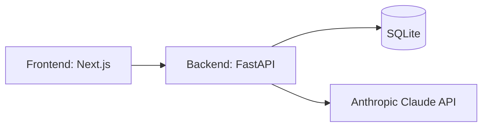

# Zenith

## Problem Statement
Job seekers need an integrated tool to beat ATS systems and prepare for interviews. Combining resume analysis and interactive interview coaching provides a cohesive platform to secure their target roles.

## Architecture


- **Auth**: JWT bearer tokens (register/login), passwords hashed with PBKDF2-SHA256 — no extra native/compiled dependencies to install.
- **Database**: SQLite by default (`backend/career_coach.db`), zero setup. Swap `DB_URL` in `.env` for Postgres later; the SQLAlchemy models don't change.
- **LLM**: Anthropic Claude (Messages API) for resume scoring and interview question generation/evaluation. If `ANTHROPIC_API_KEY` is unset or a call fails, both modules fall back to a rule-based analyzer / seed question dataset so the app still works.

## MVP Phasing
- **Phase 1**: Resume Analyzer end-to-end — PDF/DOCX parsing, LLM (or rule-based) ATS scoring, gap analysis, downloadable PDF report.
- **Phase 2**: Interview Coach — role-specific question generation (LLM + seed dataset fallback), typed answers, rubric-based LLM feedback.
- **Phase 3**: History — per-user resume scan and interview session history, viewable in the app.

## Setup Instructions
1. Copy `.env.example` to `.env` in the project root, then copy it (or symlink) into `backend/.env` as well — the backend reads `.env` from its own working directory. Fill in `ANTHROPIC_API_KEY` if you have one (optional — the app works without it via fallback logic).
2. Backend:
   ```
   cd backend
   python -m venv .venv
   .venv\Scripts\activate
   pip install -r requirements.txt
   uvicorn app.main:app --reload
   ```
   Tables are created automatically on first startup (SQLite file appears in `backend/`).
3. Frontend:
   ```
   cd frontend
   npm install
   npm run dev
   ```
4. Open the frontend dev server URL, register an account, then use the Resume Analyzer and Interview Coach.

Docker Compose is optional and not required for local dev (see comments in `docker-compose.yml`).
