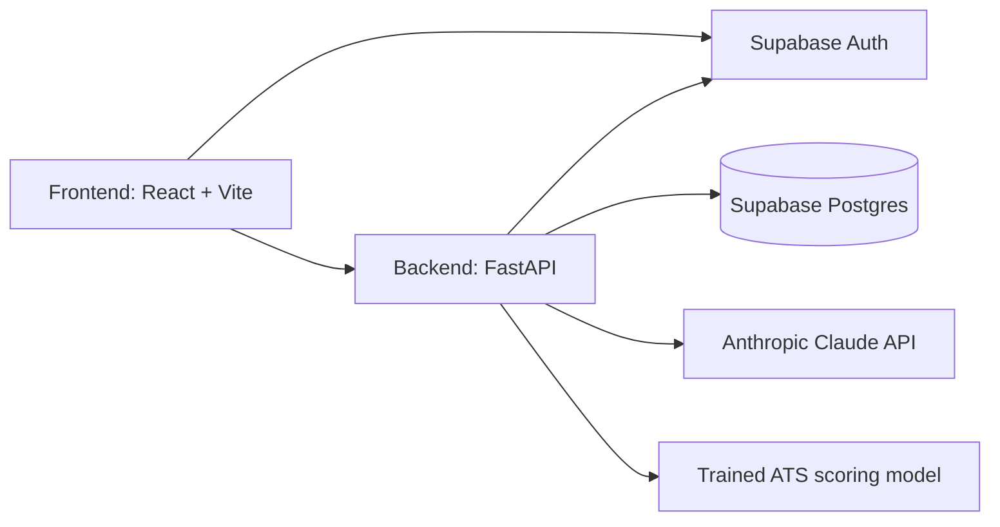

# ApplyCenter (AI Career Coach)

AI-powered resume analysis and interview coaching: upload a resume + job description, get a real ATS match score with a skills gap breakdown, then practice interview questions with AI feedback.

## Problem Statement
Job seekers need an integrated tool to beat ATS systems and prepare for interviews. Combining resume analysis and interactive interview coaching provides a cohesive platform to secure their target roles.

## Architecture

```mermaid
graph LR
    UI[Frontend: React + Vite] --> API[Backend: FastAPI]
    UI --> AUTH[Supabase Auth]
    API --> AUTH
    API --> DB[(Supabase Postgres)]
    API --> LLM[Anthropic Claude API]
    API --> ML[Trained ATS scoring model]
```

The frontend was rebuilt from the ground up in 2026-09 on the "HireLoom" Figma
design (see `MIGRATION_PLAN.md` for the full phase-by-phase record) — it
replaced the previous Next.js app entirely with a React + Vite + React Router
+ Tailwind CSS single-page app. If you worked on the old Next.js frontend,
essentially everything below in this section and the Setup Instructions is new.

## Design system

The design lives in code, not in a separate design-tool file — every token,
font, and shared primitive below is defined directly in `frontend/src/`.

- **Colors** — CSS variables in `frontend/src/index.css` (`:root` for light,
  `.dark` for dark mode), mapped onto shadcn's standard HSL variable names
  (`--primary`, `--secondary`, `--muted`, `--border`, etc.) plus three
  HireLoom-specific accent tokens shadcn doesn't have: `--coral`/`--coral-tint`
  (AI badges, accents), `--success`/`--success-tint`, and
  `--warning`/`--warning-tint` (all three used for the app's score-tier
  banding — see `frontend/src/lib/scoreTone.ts`). `frontend/tailwind.config.js`
  exposes all of these as normal Tailwind utility classes (`bg-primary`,
  `text-coral`, `border-warning`, …) — component code never references a hex
  value directly.
- **Fonts** — Inter (body/UI text, `font-sans`, the Tailwind default) and
  Manrope (headings and numeric emphasis, the `font-heading` utility class).
  Both are loaded via a Google Fonts `@import` at the top of `index.css`.
- **Key shared components** (`frontend/src/components/`):
  - `shared/Logo.tsx`, `shared/WovenPattern.tsx` — the brand mark and the
    faint repeating weave background motif used across marketing/auth surfaces.
  - `shared/ScoreRing.tsx` — SVG stroke-based score ring (dashboard KPI tiles,
    job-match %).
  - `shared/ConicRing.tsx` — flat conic-gradient score ring (readiness scores,
    ATS score, interview average) — a separate primitive from `ScoreRing`
    because it's a solid arc, not an SVG stroke. Its color band is adaptive:
    every usage colors the arc red/orange/green by score tier via
    `lib/scoreTone.ts`'s `getScoreTone()`/`scoreToneClass()`, so a score ring
    never shows one fixed color regardless of how good or bad the number is.
  - `shared/PasswordField.tsx` — password input with a strength meter
    (`lib/passwordStrength.ts`) and a show/hide toggle.
  - `layout/AppShell.tsx`, `layout/Sidebar.tsx`, `layout/Header.tsx`,
    `layout/CommandPalette.tsx` — the authenticated app's shell: collapsible
    sidebar with the real-time readiness widget, topbar with search/⌘K
    command palette/notifications, and the shared page-content spacing every
    route inherits.
  - `layout/AuthLayout.tsx` — the split-panel layout (indigo gradient brand
    panel + centered form) shared by every auth page.
  - `ui/*.tsx` — the shadcn/Radix primitive layer (button, card, input,
    select, dialog, sheet, switch, checkbox, etc.), restyled to HireLoom's
    exact spacing/radius/shadow spec but keeping each component's original
    props/API.

- **Auth**: Supabase Auth (email/password + verification, password reset, Google OAuth). The frontend talks to Supabase directly via `@supabase/supabase-js` (`frontend/src/lib/supabase.ts`), holding the session client-side (no server to hold an httpOnly cookie in a static SPA); the backend verifies the same Supabase-issued JWT on every API request (JWKS-based, no shared secret needed on modern Supabase projects).
- **Database**: Supabase Postgres. Schema is managed with Alembic migrations (`backend/alembic/`) — never edited by hand against the live DB.
- **LLM**: Anthropic Claude (Messages API, tool-use-forced JSON) for resume scoring, interview question generation, and answer evaluation. If `ANTHROPIC_API_KEY` is unset or a call fails, the resume analyzer falls back to a rule-based keyword scorer and the interview coach falls back to a seed question dataset, so the app still works without a key.
- **Trained ATS model** (`backend/app/ml/`): a small, fast regression model trained on LLM-labeled `(resume, job description, score)` pairs — see "ATS scoring model" below. Optional; the LLM/rule-based path above is what the live app uses today.

### Frontend dependencies

The frontend's entire dependency tree is new as of the Figma migration — it
replaced the previous Next.js app's `package.json` outright, not just added
to it. The current stack: **React 18 + React Router 7** (routing), **Vite 6**
(build tool — `vite.config.ts`), **Tailwind CSS 3** (`tailwind.config.js`,
`postcss.config.js`) with `tailwindcss-animate`, **Radix UI** primitives
(`@radix-ui/react-*` — avatar, checkbox, dialog, dropdown-menu, label,
select, separator, slot, switch) wrapped by the `components/ui/*` shadcn-style
layer, **`@supabase/supabase-js`** for auth, **`recharts`** for every chart,
**`lucide-react`** for icons, **`sonner`** for toasts, **`class-variance-authority`**
+ **`clsx`** + **`tailwind-merge`** for the `cn()` styling helper, **`jspdf`**
for tailored-resume PDF export, and **`canvas-confetti`** for the interview
feedback celebration. No test runner, form-validation library, or state
management library is installed — the app doesn't use one.

## Prerequisites
- **Python 3.12+** — not 3.11. `numpy` 2.5.1 declares `requires_python >= 3.12`, so 3.11 fails at install with a misleading "no matching distribution" error.
- **Node.js 24** (ships npm 11) — 24 is what CI pins and what generated `package-lock.json`. Node 20 is too old for `@supabase/supabase-js` (needs >= 22), and Node 22 ships npm 10, which resolves optional wasm bindings into a different tree and makes `npm ci` fail. Use 24 and `npm ci` works everywhere.
- **Git**
- A **Supabase** project (ask a teammate for shared dev credentials, or create your own at [supabase.com](https://supabase.com))
- An **Anthropic API key** (optional but recommended — [console.anthropic.com](https://console.anthropic.com)); the app works in a degraded mode without one

## Setup Instructions

**Short version** — clone, then:

```
git config core.hooksPath .githooks
npm run setup
npm run dev
```

`npm run setup` creates env files from the templates, builds the Python
virtualenv, and installs both dependency sets. Fill in the two env files it
reports, run `npm run migrate`, then `npm run dev`. The long version below
explains each step.

---

1. **Clone the repo:**
   ```
   git clone https://github.com/dv-saiharsha/AI-Career-Coach.git
   cd AI-Career-Coach
   ```

2. **One-time: enable the team git hooks** (see "Working as a team" below for what this does):
   ```
   git config core.hooksPath .githooks
   ```

3. **Create your env files from the templates:**
   ```
   scripts\setup-env.bat          REM Windows
   bash scripts/setup-env.sh      # macOS / Linux / Git Bash
   ```
   This copies `frontend/.env.local.example` -> `frontend/.env.local` and
   `backend/.env.example` -> `backend/.env`. It never overwrites a file that
   already exists, so it is safe to re-run after a pull that adds a new
   variable. Then fill in the real values — ask a teammate for shared dev
   credentials rather than creating your own Supabase project, since the
   database is shared and a fresh project will not have the schema.

4. **Backend:**
   ```
   cd backend
   python -m venv .venv
   .venv\Scripts\activate
   pip install -r requirements.txt
   ```
   Fill in `backend/.env` (created in step 3) — `DB_URL` (Supabase Postgres connection string), `SUPABASE_URL`, `ANTHROPIC_API_KEY`. See the comments in `.env.example` for exactly where to find each value in the Supabase/Anthropic dashboards.

   Apply the database schema:
   ```
   python -m alembic upgrade head
   ```

5. **Frontend:**
   ```
   cd frontend
   npm ci
   ```
   `npm ci` rather than `npm install`: it installs exactly what `package-lock.json`
   pins, so everyone gets an identical tree. Use `npm install` only when you are
   deliberately adding or upgrading a dependency.

   Fill in `frontend/.env.local` (created in step 3) — `VITE_SUPABASE_URL` and `VITE_SUPABASE_PUBLISHABLE_KEY` (same Supabase project as the backend). `VITE_API_BASE_URL` defaults to `http://localhost:8000/api`, which is correct for local dev with both servers running.

6. **Run both servers with one command** from the repo root:
   ```
   npm run dev
   ```
   Starts the backend (:8000) and frontend (:3000) together with prefixed
   output. Ctrl+C stops both, and if either crashes the other is stopped too,
   so you never end up with an orphaned server holding a port. Windows users
   can still double-click `start.bat`, which now just calls this.

   To run them separately instead:
   ```
   npm run backend -- -m uvicorn app.main:app --reload --port 8000
   npm --prefix frontend run dev
   ```

7. Open `http://localhost:3000`, register an account (check your email to verify), then use the Resume Analyzer and Interview Coach.

## Root commands

Run these from the repo root; they work the same on Windows, macOS and Linux.

| Command | What it does |
|---------|--------------|
| `npm run setup` | Env files, Python virtualenv, both dependency sets. Idempotent. |
| `npm run dev` | Backend + frontend together, prefixed output, Ctrl+C stops both |
| `npm start` | Same, production mode (`npm run build` first) |
| `npm run build` | Production build of the frontend |
| `npm test` | Backend test suite |
| `npm run check` | Everything CI runs — do this before pushing |
| `npm run migrate` | `alembic upgrade head` (review first — the database is shared) |
| `npm run backend -- <args>` | Any command against the venv Python |

### Serving the production build

`npm run dev` and `npm start` both just work. To build and preview the
production bundle directly instead:

```bash
cd frontend
npm run build      # tsc -b && vite build — outputs to frontend/dist/
npm run start      # vite preview --port 3000 --host — serves dist/
```

`vite preview` is a static-file server with the same client-side-routing
fallback the app needs (any unknown path resolves to `index.html`, which
`react-router-dom` then takes over) — good for previewing a production build
locally or in the Docker image (see `frontend/Dockerfile`), not a substitute
for a hardened production web server if this is ever serving real traffic
behind a load balancer.

### Reaching either app from a phone

Vite prints a `Network:` URL, and on a machine with WSL or Docker installed
that URL is often the Hyper-V virtual adapter (`172.28.x.x`), which no phone
can route to. Use the Wi-Fi address from `ipconfig` instead.

The mobile app needs the same address in `mobile/.env` as
`EXPO_PUBLIC_API_URL`, and the backend has to be bound to all interfaces
rather than loopback:

```bash
npm run backend -- -m uvicorn app.main:app --host 0.0.0.0 --port 8000
```

## ATS scoring model (optional, in progress)
`backend/app/ml/` holds a trained regression model that scores resumes numerically instead of via an LLM call — faster, free to run, and deterministic. It's trained on data produced by scripts in `backend/scripts/`:

- `generate_seed_resumes.py` / `generate_job_descriptions.py` — generate synthetic training resumes/JDs via Claude (each has a `--confirm` gate and prints a cost estimate first — never run `--confirm` without knowing the cost).
- `generate_training_data.py` — labels `(resume, JD)` pairs using the same LLM analyzer the live app uses, caching every label so reruns cost nothing.
- `train_ats_model.py` — trains the model with 5-fold cross-validation and reports honest MAE/R² (also free — no API calls, pure local scikit-learn).

The trained model file (`app/ml/models/*.joblib`) is gitignored — regenerate it locally by running `train_ats_model.py` against `backend/data/training_data.csv` (also gitignored/local; regenerate via the scripts above). `app/ml/models/ats_model_metadata.json` (accuracy, dataset size, training date) *is* tracked, so everyone can see what the last trained run achieved without retraining.

## Continuous integration

Every push and pull request runs [`.github/workflows/ci.yml`](.github/workflows/ci.yml),
which is what makes `main` safe to pull:

| Job | Steps |
|-----|-------|
| **Backend: lint and test** | `ruff check .` then `pytest -q` on Python 3.12 |
| **Frontend: lint, typecheck and build** | `npm ci`, `npm run lint`, `npm run typecheck`, `npm run build` on Node 24 |

The frontend **build** is the check that matters most — it catches broken
imports and other real compile/bundling failures that lint and typecheck alone
can miss.

The build step supplies placeholder Supabase values when repository secrets are
not configured, so the pipeline is deterministic on forks and for contributors
without credentials. It never needs real secrets to prove the app compiles.

**Reproduce CI locally before pushing** — these are the exact commands it runs:

```
cd backend  && ruff check . && pytest -q
cd frontend && npm ci && npm run lint && npm run typecheck && npm run build
```

Two gotchas worth knowing, both of which have already bitten this repo:

- Run `pytest`, not only `python -m pytest`. The latter puts the working
  directory on `sys.path` and can pass when CI's invocation would fail.
  `backend/pytest.ini` sets `pythonpath` so both now behave the same.
- `package-lock.json` is platform-sensitive for optional native/wasm packages.
  If you regenerate it, do so on Linux (or expect CI to disagree with your
  machine). Prefer `npm ci` for everyday installs so you never regenerate it by
  accident.

## Production Deployment

Both services are containerized (`backend/Dockerfile`, `frontend/Dockerfile`), and `docker-compose.yml` runs the full stack — backend, frontend, and Redis — locally in that shape without a full deploy. Layer `docker-compose.prod.yml` on top for a production-shaped run:

```
docker compose -f docker-compose.yml -f docker-compose.prod.yml up -d
```

That overlay sets `ENVIRONMENT=production`, which turns on real enforcement — see below. It does not supply TLS termination, a real `DB_URL`, or secrets; those are the deployer's responsibility, same as any other container deployment.

**Continuous delivery builds and publishes images; it does not deploy them.** `.github/workflows/publish.yml` triggers on `workflow_run` of the CI workflow completing successfully on `main` — not on its own `push` trigger, so there is exactly one place that decides a commit is good, and an image is only ever built from a commit CI has already certified (the exact SHA CI ran against, not whatever `main` has moved to by the time the build starts). It builds and pushes both images to GHCR, tagged `:latest` and `:sha-<short-sha>`, using the repo's own `GITHUB_TOKEN` for registry auth — no extra secret needed for that part.

The frontend image needs three more secrets before it's a real, working build — `VITE_*` is baked into the client bundle at this build step, not read later at container start (same rule as the manual build above):

- `PROD_VITE_API_BASE_URL`
- `PROD_VITE_SUPABASE_URL`
- `PROD_VITE_SUPABASE_PUBLISHABLE_KEY`

(If this repo previously had `PROD_NEXT_PUBLIC_*` secrets configured from the old Next.js frontend, they no longer do anything — add the `PROD_VITE_*` ones above instead.)

Set these under **Settings → Secrets and variables → Actions**. Until they're set, the workflow still runs (falling back to inert placeholders so it doesn't hard-fail), but the resulting frontend image points at `localhost` and a Supabase project that doesn't exist — don't run that build in production.

**What ships after that is still a manual (or externally-triggered) step.** This repo has no configured deploy target — no VPS, no PaaS account, nothing to `docker compose pull` on automatically. Pulling the new images onto wherever this actually runs, and restarting the stack, is the one piece intentionally left out until there's a real server or platform to point it at.

**The crawler is the only job source.** Every `job_listings` row comes from an employer's own ATS board (via `job_market/crawler.py` or the older `job_market/ingestion.py` sweep) or a careers page's JSON-LD markup — there is no other way a row gets into that table. JSearch and Active Jobs (both RapidAPI products this app used as an on-demand aggregator for employers on no known ATS) have been removed entirely, along with `RAPIDAPI_KEY`/`RAPIDAPI_HOST`/`JOB_SOURCE` and every code path that read them. The Job Portal's search (`job_market/services.py:search_jobs`) is a full-text query straight against `job_listings` — Postgres uses a real `to_tsvector` match backed by the `ix_job_listings_fts` GIN index, SQLite (local dev) falls back to a substring match — and never makes an external call at request time; a term the crawler hasn't found anything for yet returns an honest empty result; there is nothing left to queue a refresh for.

**The `worker` service.** `docker-compose.yml` also defines `worker` — the same backend image, running `python -m app.worker` instead of the API (`app/worker.py`). It's what runs the hourly job crawl (`job_market/crawler.py`, reading the `companies` table) out of the request-serving process; see `CRAWLER_PLAN.md` §4 for why. It comes up automatically with the rest of the stack:

```
docker compose -f docker-compose.yml -f docker-compose.prod.yml up -d
```

A normal deploy — pull new images, restart everything — is unchanged, just with one more container:

```
docker compose -f docker-compose.yml -f docker-compose.prod.yml pull
docker compose -f docker-compose.yml -f docker-compose.prod.yml up -d
```

To restart only the worker (after an env change, say), without touching the API or frontend:

```
docker compose -f docker-compose.yml -f docker-compose.prod.yml up -d --no-deps --force-recreate worker
```

`docker-compose.prod.yml` sets `JOB_SWEEP_ENABLED=false` on `backend` in production — `worker` now covers what `job_market/scheduler.py`'s older in-process board sweep used to do, so there's no reason to keep paying for both. Local dev (`docker-compose.yml` alone, no prod overlay) is unaffected: `JOB_SWEEP_ENABLED` defaults `true` there exactly as it did before `worker` existed, so a bare `docker compose up` still works with no extra setup. Running both at once (e.g. by also starting `worker` locally) is wasteful, not wrong — every upsert here is idempotent.

The worker's crawl is guarded by a Redis distributed lock (`REDIS_URL`, already required above one `UVICORN_WORKERS`) — safe to scale `worker` to more than one replica; extra ones simply skip a tick they don't win the lock for rather than double-crawling.

**Managing the company registry.** `data/companies_seed.csv` (name, website, careers_url, ats_type, ats_slug, industry, size, active) is what `worker`/`scripts/run_crawl.py` actually crawl — not `job_market/boards_registry.py`'s older hardcoded list, which `job_market/scheduler.py`'s separate, still-running sweep still uses. To add companies: append rows to the CSV (leave `ats_type` blank for ones you don't already know), then:

```
python scripts/detect_ats.py data/companies_seed.csv     # fills in ats_type/ats_slug for blank rows
python scripts/seed_companies.py data/companies_seed.csv # loads the CSV into the companies table
python scripts/run_crawl.py                               # or scripts/run_crawl.py --company <slug> for one
```

Both scripts are safe to re-run — `detect_ats.py` never re-probes a row that already has an `ats_type`, and `seed_companies.py` upserts by `(ats_type, ats_slug)` (falling back to `name`), never duplicating a row. Crawl history and per-company health are readable at runtime through the admin API (`GET /api/admin/crawl/runs`, `GET /api/admin/crawl/companies` — gated by `ADMIN_EMAILS`), or triggered on demand with `POST /api/admin/crawl/run` / `POST /api/admin/crawl/companies/{id}/run`.

**Fail-fast configuration.** `app/core/config.py`'s `validate_startup()` refuses to boot at all — not "boots and fails on the first request" — when `ENVIRONMENT=production` and any of these are missing or still at their development default: `DB_URL` (must not be the local SQLite fallback), `SUPABASE_URL`, `SUPABASE_JWT_SECRET`, `ANTHROPIC_API_KEY`, `ALLOWED_ORIGINS` (must not be empty or `*`). Every other setting (`DEEPGRAM_API_KEY`, `REDIS_URL`) stays optional in every environment, since those features are designed to degrade gracefully when unset — see the Architecture section above.

**CORS.** `ALLOWED_ORIGINS` is a comma-separated list, read from settings rather than hardcoded — set it to your real frontend origin(s) in production. It is never `*` in production; `validate_startup()` enforces that directly.

**Health check.** `GET /health` checks real database connectivity (not just process liveness) and returns 503 if the database is unreachable — point an orchestrator's readiness probe at it, not a static "is the process alive" check.

**Multi-worker deployments need Redis.** `core/events.py`'s SSE fan-out is in-process by default — correct for one worker, silently wrong for more than one (an event published on worker A never reaches a client connected to worker B). Set `REDIS_URL` before running `UVICORN_WORKERS` above 1. This produces no errors either way — it's a correctness gap, not a crash — so treat it as a hard requirement, not a tuning knob. (The job feed itself has no in-process state to worry about here any more — see "The crawler is the only job source" below.)

**Frontend build-time vs. runtime configuration.** `VITE_*` variables are inlined into the client JavaScript bundle at `vite build` time, not read when the container starts. Pass them (see `frontend/Dockerfile`'s `ARG`s) as Docker build args, not environment variables at `docker run` time — an image built without a real `VITE_SUPABASE_URL` will silently point at a placeholder Supabase project.

**Logging.** The backend calls `logging.basicConfig()` at startup using `LOG_LEVEL` (default `INFO`); an unhandled exception anywhere is caught by a root handler in `main.py` and logged with the request path before returning a generic 500, rather than falling through to a bare stack trace with no context.

## Backend TODO (from the Figma migration)

Restyling every screen to the Figma design surfaced real backend gaps — cases
where a Figma element has no supporting field, endpoint, or table yet. Each
one is documented in detail, page by page, in `MIGRATION_PLAN.md`'s "Backend
TODO" subsections; this is the condensed index:

- **Resume Tailor** — no endpoint to apply a suggested fix back onto stored
  resume text; no per-suggestion quantified impact score; no named saved
  versions; pasted (no-`job_id`) job descriptions can't get gap analysis or
  AI bullet suggestions, only a compiled score.
- **Cover Letter Generator** — no `length` parameter; generated letters are
  never persisted, so they can't be linked to an Application record or shown
  in History.
- **Interview Coach** — no session duration/difficulty parameter; voice
  metrics (filler words, pace, confidence) never populate for typed-answer
  sessions, by design; STAR-structure scoring only exists in the separate,
  unwired "story bank" feature.
- **Job Portal** — company size/industry exist on the `companies` table but
  are not yet surfaced on `JobListing`'s own payload; no un-save endpoint (Save
  can only add, never retract); job match has 2 real dimensions, not
  Figma's fabricated independent 3-reason breakdown; `postedDaysAgo` is
  day-granularity only.
- **Applications** — no `priority` field; no free-text "next step" field;
  only one recruiter contact per application, not a list; no way to link a
  generated cover letter to an application.
- **Offer Comparison** — no Growth/Team/Flexibility/Benefits/PTO fields on
  `JobOffer` (Best Fit's non-compensation dimensions are user-entered and
  device-local only); no AI/LLM-backed negotiation tips — it's deterministic
  client-side arithmetic over the user's own entered offers.
- **Profile & Settings** — no work-history/education storage; no
  portfolio/LinkedIn/Dribbble URL fields; no location/salary-range/work-style
  preference fields; no per-category server-side notification delivery
  preferences (currently `localStorage`-only); no OAuth beyond Supabase's
  Google sign-in; no server-side privacy/analytics-sharing flags (also
  `localStorage`-only); **no subscription/billing system at all** — the
  Billing tab shows illustrative content, not real state (see below).
- **Progress/Analytics** — no historical snapshot of the readiness score
  (can't show a real "+N since" delta); no cross-user percentile/ranking; no
  persisted weekly-goal concept; no per-skill score-over-time tracking; no
  per-day activity log (so no real streak/heatmap); no achievement/badge
  system.
- **Checkout / Payment Success** — everything. There is no payment
  processor, plan model, or order/receipt persistence anywhere in the
  backend; see below.
- **Onboarding** — no dedicated onboarding flow exists yet at all (deferred —
  needs a product decision on which backend fields it should persist before
  it can be built for real; see `MIGRATION_PLAN.md`'s Phase 2).

## Placeholder content to replace before public launch

Three areas intentionally still show fabricated/illustrative content instead
of real data or an honest empty state — each is visibly labeled as such in
the UI (a "Prototype"/"illustrative" note, or a TODO comment in the source)
and was a deliberate, explicit decision to match the Figma design exactly
while the real backend for it doesn't exist yet:

- **Settings → Billing** (`frontend/src/pages/settings/SettingsPage.tsx`,
  `BillingSettings`) — shows a "Pro · Current plan" framing, invented feature
  lists, fabricated usage numbers, and a fake paid invoice history. No real
  subscription/billing system backs any of it.
- **Checkout / Payment Success**
  (`frontend/src/pages/checkout/CheckoutPage.tsx`,
  `PaymentSuccessPage.tsx`) — a full card-entry form and a "payment
  successful" receipt, neither backed by a real payment processor. Nothing
  typed into the form is ever stored, logged, or transmitted anywhere; the
  summary column's own banner discloses "Prototype checkout: no real payment
  will be processed."
- **Landing page** (`frontend/src/pages/LandingPage.tsx`) — the results/stats
  band ("2× more interview callbacks", etc.), the testimonials section, and
  the pricing figures are marketing placeholders, each flagged with a
  `// TODO:` comment in the source pointing at what needs to be verified or
  confirmed before publishing.

Before this ships to real users, either build the real systems behind these
three, or swap them back to an honest empty/Free-only state. Whoever picks
this up should start from the `// TODO` comments and the doc comments at the
top of each component above — they explain exactly what's fake and why.

## Working as a team

**Dependencies auto-install after `git pull`.** After the one-time `git config core.hooksPath .githooks` step above, every `git pull` that brings in a changed `backend/requirements.txt` or `frontend/package.json`/`package-lock.json` automatically reinstalls the right dependencies — nobody has to remember to run `pip install` or `npm install` after pulling someone else's changes. This is a per-machine git setting (a git limitation, not a shortcut skipped here), which is why it's a one-time command rather than something that "just works" on clone.

**Database migrations are never auto-applied**, even by the hook above — the Supabase database is shared across the team, so a schema change from someone else's pull only prints a reminder to review and run `alembic upgrade head` yourself, rather than silently altering the shared database the moment you pull.

**Before pushing:** run the backend test suite (above) and make sure both `npm run build` (frontend) and a quick manual click-through still work. If you add a new environment variable, add it (with a placeholder, never a real value) to `backend/.env.example` or `frontend/.env.local.example` so teammates' setups keep working after they pull.
